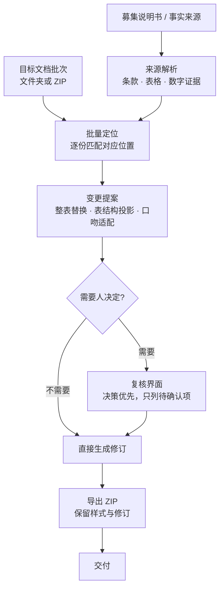

# Document Update Workbench

## 债券发行说明性文件批量更新工作台

> A batch workbench for bond issuance explanatory documents: it maps content from a source
> prospectus onto a set of target documents, freezes protected regions, adapts the wording to
> each target, and exports tracked-change DOCX with human review only where a decision is
> genuinely required.

债券发行里，一份募集说明书（事实来源）要落到**一批**说明性文件上：同一处内容在十几个文件里
各有各的表述口径，改动必须逐份对齐，还要保住主标题、盖章页这类不能动的区域。
本工作台把「来源解析 → 批量定位 → 变更提案 → 人工确认 → 导出修订版」做成一条批量流水线：
一次导入一批目标文档，**只把真正需要人决定的事项推到复核界面**，其余按规则自动执行。


---

## 核心能力

| 能力 | 说明 |
|---|---|
| **批量处理** | 一次导入一批目标文档（文件夹或 ZIP），一次导出 ZIP 结果包，而不是逐个文件手工改 |
| **双入口同一内核** | 本地 Web 界面与命令行 `run_batch.py` 走同一条分析内核，结果口径一致 |
| **来源到目标的映射** | 把募集说明书的条款与表格映射到各目标文档的对应位置，支持整表替换与表结构投影 |
| **保护区域冻结** | 主标题、盖章页等固定区域在口吻扫描中被排除，不会被自动改写 |
| **口吻适配** | 把来源措辞适配成目标文档的表达口径，而不是把来源原文整段搬过去 |
| **只推真正需要的决策** | 无需人工确认时直接进入导出；有需要时才进入"决策优先"的比较界面 |

## 处理流程



## 技术实现

| 层 | 实现 |
|---|---|
| 运行时 | **Python 3.9+，只用标准库**（无必装第三方依赖） |
| 相似度加速（可选） | `rapidfuzz` 存在时自动启用以加速匹配；缺失时回退到标准库 `difflib` 实现，行为一致 |
| 服务层 | 基于标准库构建的轻量本地 HTTP 服务，只监听本机回环地址，会话 URL 带一次性 token |
| 文档层 | 自研 OOXML 处理层（`zipfile` + `xml.etree`），直接读写文档部件 |
| 前端 | 原生 HTML / CSS / JavaScript，无框架、无构建步骤 |
| 测试 | `pytest` + `python-docx`（**仅用于构造测试样本，非运行时依赖**） |
| 命令行 | `run_batch.py`：`募集说明书 + 目标ZIP → 结果ZIP`，可在无界面环境批量跑 |

## 测试与质量基线

```bash
pip install pytest "python-docx>=1.1,<2"
python -m pytest -q
```

```
39 passed, 1 skipped
```

- 在 **Python 3.13 与 Python 3.9.6** 两个版本上分别复现，结果一致（`39 passed, 1 skipped`）。
- 覆盖：来源/目标分类与去重、整表替换、表结构投影、保护区域冻结、口吻规则边界、
  数字漂移刷新、导出后接受/拒绝修订的还原、以及"只展示需要决策事项"的界面行为。
- `tests/test_protection_rules.py` 专门锁定「独立核查程序与结论保留」规则的触发面：
  命中各种证券公司写法（含 `股份有限公司` / `有限责任公司` 后缀），
  不命中不含「证券」二字的主体（发行人、会计师事务所、律师事务所），
  并断言该模式**不得**退化成吞掉任意非空字符的写法。

## 快速开始

Web 界面：

```bash
python start.py
```

运行时不需要安装任何第三方依赖；`python-docx` 只在跑测试时需要。

命令行批处理（适合批跑、无界面环境）：

```bash
python run_batch.py 募集说明书.docx 目标文件批次.zip --out 更新结果.zip --author 你的名字
```

服务只监听本机回环地址，文档不会离开这台机器。

## 项目结构

```
start.py                  启动入口（Web）
server.py                 本地 HTTP 服务与 API
run_batch.py              命令行批量入口
explain_core.py           批量分析内核
engine_manifest.json      引擎文件指纹清单
check_engine_sync.py      校验引擎指纹是否与清单一致
workbench/                文档处理模块（OOXML 读写、匹配、映射、审计）
tests/                    回归测试
web/                      前端（原生 JS）
tools/public_release_check.py   公开版脱敏自检
```

## 数据安全

本仓库是**脱敏后的公开版本**：只包含通用源码、批量更新逻辑与回归测试。
真实募集说明书、说明性文件、验收材料与导出结果一律不进入版本库，
相关目录已由 `.gitignore` 排除。正式部署版本与本公开仓库分开维护。

## 许可

本仓库当前未附开源许可证。公开可见不等于自动获得复制、修改与再分发许可。
如需复用，请先联系作者确认授权。
