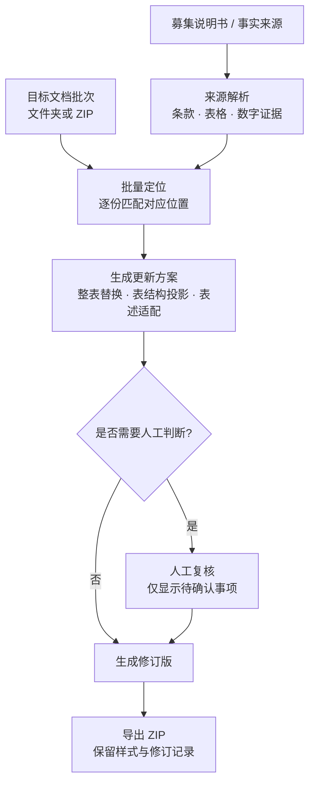

# Document Update Workbench

## 债券发行说明性文件批量更新工作台

> A local batch workbench for structured document updates, tracked changes, protected-region handling and format-preserving replacement.

## 界面


> 截图使用虚构/合成数据，仅用于展示程序界面，不包含任何真实业务材料。

该工具用于将募集说明书中的更新内容同步到一批说明性文件。系统识别来源条款、表格和数字信息，在目标文档中定位对应位置，并根据不同文件的表述方式生成更新方案。主标题、盖章页等受保护区域不参与自动改写；仅在规则无法确定处理方式时进入人工复核。

## 核心能力

| 能力 | 说明 |
|---|---|
| **批量处理** | 支持文件夹或 ZIP 批量导入，并以 ZIP 形式输出处理结果 |
| **统一处理内核** | Web 界面与命令行 `run_batch.py` 使用同一套分析和写入逻辑 |
| **来源映射** | 将募集说明书中的条款、表格和数字证据映射到目标文档的对应位置 |
| **受保护区域隔离** | 主标题、盖章页等固定区域从自动改写流程中排除 |
| **表述适配** | 在保留事实内容的前提下，按照目标文档的表达方式生成更新文本 |
| **人工复核** | 仅将无法由现有规则确定的事项提交人工确认 |

## 处理流程



## 技术实现

| 层 | 实现 |
|---|---|
| 运行时 | Python 3.9+；核心运行逻辑仅使用标准库 |
| 相似度加速（可选） | 安装 `rapidfuzz` 时用于加速匹配；缺失时回退到标准库 `difflib` |
| 服务层 | 基于标准库的本地 HTTP 服务，仅监听本机回环地址，会话使用一次性 token |
| 文档层 | 自研 OOXML 处理层（`zipfile` + `xml.etree`），直接操作文档部件 |
| 前端 | 原生 HTML / CSS / JavaScript |
| 测试 | `pytest` + `python-docx`，仅用于构造测试样本 |
| 命令行 | `run_batch.py` 支持无界面批处理 |

## 测试与质量基线

```bash
pip install pytest "python-docx>=1.1,<2"
python -m pytest -q
python check_engine_sync.py
```

```text
39 passed, 1 skipped
ENGINE SNAPSHOT OK 23 files
```

- 已在 Python 3.9.6 与 Python 3.13 环境复现。
- 测试覆盖来源/目标分类、整表替换、表结构投影、受保护区域、表述规则、数字刷新、修订还原和人工复核界面等关键环节。
- 引擎快照校验用于确认公开版核心文件与清单保持一致。

## 快速开始

Web 界面：

```bash
python start.py
```

命令行批处理：

```bash
python run_batch.py 募集说明书.docx 目标文件批次.zip --out 更新结果.zip --author 你的名字
```

服务仅监听本机回环地址，文档处理不依赖外部服务。

## 项目结构

```text
start.py                       Web 启动入口
server.py                      本地 HTTP 服务与 API
run_batch.py                   命令行批处理入口
explain_core.py                批量分析内核
engine_manifest.json           引擎文件指纹清单
check_engine_sync.py           引擎一致性校验
workbench/                     OOXML 读写、匹配、映射与审计
tests/                         回归测试
web/                           前端
tools/public_release_check.py  公开版脱敏检查
```

## 数据安全

本仓库为脱敏后的公开版本，仅包含通用源码、批量更新逻辑和回归测试。真实募集说明书、说明性文件、验收材料和导出结果不进入版本库，正式部署版本与公开仓库分开维护。

## 许可

本仓库当前未附开源许可证。公开可见不代表自动授予复制、修改或再分发权限；如需复用，请先联系作者确认授权。
