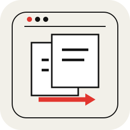
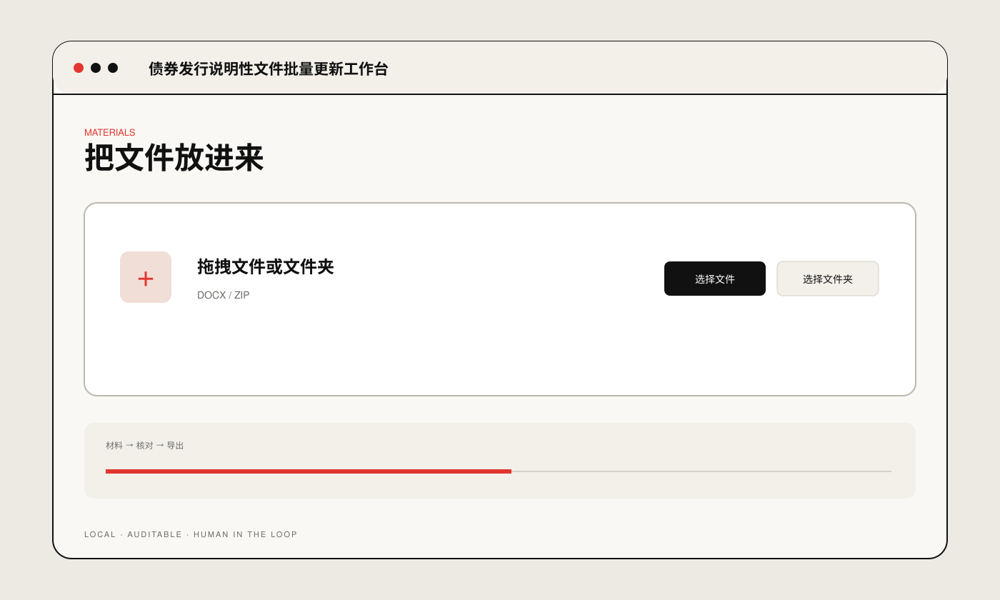

# Document Update Workbench

**债券发行说明性文件批量更新工作台**

A local workbench for structured document updates, tracked changes and format-preserving content replacement.

## Preview

## Run locally

- macOS: `./start_mac.command`
- Windows: `start_windows.bat`
- CLI: `python run_batch.py`

Public portfolio edition. No real client documents, production data or internal materials are included.
